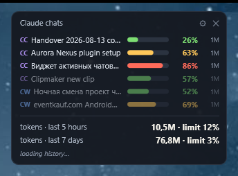
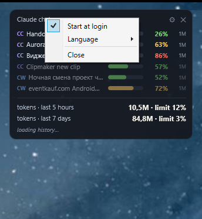

# Claude Context Meter

A small always-on-top widget for Windows that shows how full the context window of each
running Claude chat is — Claude Code and Cowork side by side — plus how many tokens you
have burned through in the rate-limit windows.



PowerShell and built-in WPF, no additional dependencies. Chat data stays local.

## Claude and Codex tabs

Switch between **Claude** (Claude Code and Cowork) and **Codex** at the top. Only the
selected source scans folders, reads logs, and checks processes. The other source keeps
its cache in memory and resumes from its saved offsets when selected again. The selection
survives restarting the widget. This pauses the widget's monitoring, not the agents themselves.

Codex shows up to six chats active within the last three hours, including desktop and CLI.
These are recent chats, not a confirmed list of open windows. Titles come from
`%USERPROFILE%\.codex\session_index.jsonl`; context usage and window size come from
`%USERPROFILE%\.codex\sessions\**\*.jsonl`. `CODEX_HOME` overrides the default directory.
Cached input is already included in `input_tokens` and is not counted again. Percentages
refresh when usage is written to the log; an unknown window shows `…`. Clicking a row
brings the Codex application window forward.

The Codex footer shows recorded plan usage for 5-hour and 7-day windows. Missing data,
records older than two hours, expired reset times, or different window durations show `—`.
Subagents are excluded from the chat rows.

## What a row tells you

```
CC  Handover 2026-08-13    ███████░░░   63%   1M
```

| Part | Meaning |
|---|---|
| `CC` / `CW` | which surface the chat belongs to — Claude Code or Cowork |
| title | the real chat title, as the app shows it |
| bar | how full the context window is — green, amber past 60 %, red past 80 % |
| `63 %` | the last prompt measured against that window |
| `1M` | the size of the window itself |

That last column matters more than it looks: 80 % of 200k and 80 % of 1M are very
different situations, and a percentage on its own hides which one you are in.

Rows dim after 30 minutes of silence. Hovering a row shows the project path, the exact
token count, the model, and when the chat was last active. Clicking one brings the Claude
window to the front and leaves its size alone — a maximised window stays maximised.

The footer adds up every session, subagents included, over the two rate-limit windows.
The weekly one is counted from the account's own weekly reset rather than over the last
seven days, because tokens from before the reset no longer count against anything. The
widget learns that moment from Claude Code, which writes the exact reset time into the
transcript whenever it reports the weekly limit; until it has seen one, the window rolls
over the last seven days. A small line underneath says when the next reset comes.

When the app has recorded plan usage, its percentage stands next to each total for as
long as that window has not turned over: five hours for the short one, until the next
reset for the weekly one. The app records it only a few times a day, so a figure older
than a quarter of an hour carries its time.

## Running it

Installed, it starts as **`ClaudeContextMeter.exe`**. That executable carries the name,
publisher and icon, and runs the script inside its own process, so Task Manager lists one
process called *Claude Context Meter* rather than an anonymous *Windows PowerShell*, and as
a windowed program it never opens a console. `build.ps1` compiles it from `launcher\`.

From a plain copy of the files, double-click **`Start-ContextMeter.vbs`**, or run

```bash
powershell -STA -NoProfile -WindowStyle Hidden -ExecutionPolicy Bypass -File ClaudeContextMeter.ps1
```

The `.vbs` exists because `powershell.exe` is a console application: Windows gives it a
console window, and `-WindowStyle Hidden` hides it only after it exists, which is the black
flash at every start. The `.vbs` creates it hidden from the outset.

Drag the widget anywhere — it remembers where you put it. `✕` hides it; it keeps running
and comes back from the tray icon. Only **Exit** in the tray menu really ends it. Launching it again while it is hidden just
brings it back — there is never a second copy.

## Settings



Click the gear, right-click the widget, or right-click the tray icon — the same settings
either way. Double-clicking the tray icon shows or hides the window.

- **Start at login** — an entry in the ordinary Windows autostart (the `Run` key of your
  account), so it appears in Task Manager's **Startup apps** tab with its icon and can be
  switched off there too. The tick is read back every time a menu opens and honours that
  switch, so the tab and the menu never disagree.
- **Language** — English, German or Russian, applied immediately.
- **Refresh rate** — Normal (3 s), Easy (10 s) or Minimal (30 s). Both the tick and the
  recursive rescan are stretched together, because the rescan is the expensive half;
  slowing only the tick would keep the cost and lose the freshness.
- **Check for updates** — on by default. Asks GitHub once at startup whether a newer
  release exists; if there is one, an **Update to x.y.z** line appears in both menus and
  downloads the installer. Every failure — offline, rate-limited, no release, no installer
  attached — is simply "no update": a version check must never be able to break the start.
- **Remember position** — on by default. The position is written the moment you finish
  dragging, not on exit: a widget that is killed rather than closed would otherwise lose
  where you put it every single time. It is validated against the whole desktop, so a spot
  on a second monitor — including one to the left of the primary, where the coordinates go
  negative — survives a restart.

The widget runs at `BelowNormal` priority, so it gets the processor only when nothing else
wants it. Together with the refresh setting that is the honest version of "keep it off my
way" — pinning it to one core would not reduce the work, only confine it.

The entry's command is built from the program's own location, and a stale path is repaired
on the next start, so moving the folder does not break it.

Up to 1.3.1 autostart was a scheduled task, at first so that it could also restart the
widget every 15 minutes. That repetition was dropped — restarting a widget on a timer hides
whatever killed it — and from then on the task did exactly what a `Run` entry does, at the
price of being invisible in the Startup apps tab. 1.3.2 moves it back: the task is replaced
by the `Run` entry on first start, the entry written first, the task removed only once that
succeeded. A Startup-folder shortcut from even older versions is taken over the same way.

## Notification area

The tray icon is the answer to "is it running, and where did it go". Its menu carries the
same settings plus **Show / Hide** and **Exit**, and it is removed on exit rather than left
as a ghost that only disappears when the mouse brushes it.

Windows 11 files new tray icons under the `^` overflow. Drag it onto the taskbar to keep
it in sight — that is the user's call to make, not something a program should force.

## Where the numbers come from

Everything is read from files Claude already writes locally:

| Source | Used for |
|---|---|
| `%USERPROFILE%\.claude\projects\**\*.jsonl` | Claude Code transcripts — token usage |
| `%APPDATA%\Claude\local-agent-mode-sessions` | Cowork transcripts and chat records |
| `%APPDATA%\Claude\claude-code-sessions` | Claude Code chat titles |
| `%USERPROFILE%\.claude\sessions` | which sessions are actually running |
| `%APPDATA%\Claude\plan-usage-history.json` | the plan usage percentages |

Nothing about your chats is sent anywhere. The widget talks to exactly one host, and only
if **Check for updates** is on: `api.github.com`, to ask this repository whether a newer
release exists. That request carries nothing but the request itself. Switch the setting off
and the widget makes no network connection at all.

The only Windows API it calls raises the Claude window when you click a row.

Its own state lives in `%LOCALAPPDATA%`: window position, the learned context windows per
model, the language, and a debug log.

### How the context window is guessed

Nothing on disk states which context window a chat runs on, so the widget works it out.
A prompt larger than 200k can only exist on a large window, so that is treated as proof.
Failing that it looks for the `[1m]` marker on the model name, then for what that model
has been caught doing before — remembered across restarts. Only when there is no evidence
at all does it fall back to an assumption.

## Requirements

Windows with Windows PowerShell 5.1 (shipped with Windows 10 and 11). Nothing else.

## Files

| File | |
|---|---|
| `ClaudeContextMeter.ps1` | widget UI and Claude monitoring |
| `CodexContext.ps1` | local Codex data reader |
| `Start-ContextMeter.bat` | launcher |
| `ClaudeContextMeter.ico` | application icon |

[Deutsche Fassung](README.de.md) · [Русская версия](README.ru.md)
