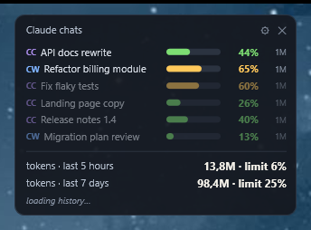
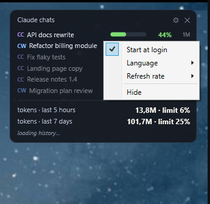

# Claude Context Meter

Маленький виджет поверх окон для Windows: показывает, насколько заполнен контекст у каждого
запущенного чата Claude — Claude Code и Cowork рядом — и сколько токенов уже потрачено
в окнах лимита.



Один скрипт на PowerShell. Без установки, без зависимостей, без сети.

## Что написано в строке

```
CC  Handover 2026-08-13    ███████░░░   63%   1M
```

| Часть | Что означает |
|---|---|
| `CC` / `CW` | откуда чат — Claude Code или Cowork |
| название | настоящее имя чата, как его показывает приложение |
| полоска | заполнение контекста: зелёная, после 60 % жёлтая, после 80 % красная |
| `63 %` | последний запрос по отношению к окну |
| `1M` | размер самого окна |

Последняя колонка важнее, чем кажется: 80 % от 200k и 80 % от миллиона — очень разные
положения, а один только процент не даёт понять, в каком вы находитесь.

Строка тускнеет после 30 минут молчания. Под курсором показываются путь проекта, точное
число токенов, модель и когда чат был активен в последний раз. Щелчок по строке выводит
окно Claude вперёд, не трогая его размер: развёрнутое остаётся развёрнутым.

Подвал складывает все сессии, включая субагентов, по двум окнам лимита — 5 часов и 7 дней.
Если приложение записало расход по плану, рядом с суммой показывается и его процент.

## Запуск

```bash
powershell -STA -NoProfile -WindowStyle Hidden -ExecutionPolicy Bypass -File ClaudeContextMeter.ps1
```

Или двойным щелчком по `Start-ContextMeter.bat`. Ярлык с иконкой делается просто: цель —
`.bat`, иконка — `ClaudeContextMeter.ico`.

Виджет перетаскивается мышью и запоминает, куда его поставили. Крестик его **прячет** —
виджет продолжает работать и возвращается из значка в трее. По-настоящему завершает работу
только пункт **«Выйти»** в меню значка.

## Настройки



Щелчок по шестерёнке, правый щелчок по виджету или правый щелчок по значку в трее — везде
одно и то же. Двойной щелчок по значку показывает или прячет окно.

- **Запускать при входе в систему** — задача в планировщике с условием «при входе»,
  от вашего имени, без прав администратора. Галочка читается из планировщика каждый раз,
  когда открывается меню: если задачу убрали снаружи, меню покажет «выключено», а не
  оставит устаревшую отметку.
- **Язык** — английский или русский, применяется сразу.
- **Частота обновления** — обычная (3 с), экономная (10 с) или минимальная (30 с). Такт и
  полное пересканирование папок растягиваются вместе: дорогая половина — именно
  пересканирование, и замедлить один такт значило бы сохранить расход и потерять свежесть.

Виджет работает с приоритетом `BelowNormal` — процессор достаётся ему только тогда, когда
он никому не нужен. Вместе с настройкой частоты это честная замена «убрать его на
свободное ядро»: привязка к ядру не уменьшила бы работу, а только заперла бы её.

Команда задачи строится из фактического расположения скрипта, а устаревший путь чинится при
следующем старте, так что переезд папки автозапуск не ломает.

Задача, а не запись в реестре `Run`, потому что запись `Run` срабатывает при входе в
систему и больше никогда — а машина, которая неделями засыпает вместо перезагрузки, может
столько же не видеть входа. Повторяющегося условия здесь намеренно нет: перезапуск виджета
по таймеру прячет то, что его убило, и лезет на экран в дни, когда Claude вообще не нужен.

Всё, чем виджет запускался раньше — ярлык в автозагрузке, запись в `Run`, — перенимается
при первом запуске: сначала регистрируется задача, и только после того, как это удалось,
старый механизм удаляется. Две записи автозапуска на одну программу — та неприятность в
диспетчере задач, которую лучше исключить по устройству.

## Значок в области уведомлений

Значок в трее отвечает на вопрос «работает ли он и куда делся». В его меню те же настройки
плюс **«Показать / Скрыть»** и **«Выйти»**, а при выходе значок явно удаляется, а не
остаётся призраком, который исчезает, только если провести по нему мышью.

Windows 11 складывает новые значки под стрелку `^`. Чтобы значок был на виду, перетащите
его оттуда на панель задач — это выбор пользователя, а не то, что программа должна решать
за него.

## Откуда берутся цифры

Всё читается из файлов, которые Claude и так пишет локально:

| Источник | Для чего |
|---|---|
| `%USERPROFILE%\.claude\projects\**\*.jsonl` | транскрипты Claude Code — расход токенов |
| `%APPDATA%\Claude\local-agent-mode-sessions` | транскрипты и записи чатов Cowork |
| `%APPDATA%\Claude\claude-code-sessions` | названия чатов Claude Code |
| `%USERPROFILE%\.claude\sessions` | какие сессии действительно запущены |
| `%APPDATA%\Claude\plan-usage-history.json` | проценты расхода по плану |

Наружу не уходит ничего. Сетевого кода в скрипте нет вовсе — ни HTTP-клиента, ни сокетов.
Единственный вызов Windows API поднимает окно Claude, когда вы щёлкаете по строке.

Своё состояние виджет держит в `%LOCALAPPDATA%`: положение окна, выученные размеры окна
контекста по моделям, язык и отладочный лог.

### Как определяется размер контекста

Нигде на диске не записано, на каком окне работает чат, поэтому виджет выясняет это сам.
Запрос больше 200k может существовать только на большом окне — это считается
доказательством. Если его нет, смотрится метка `[1m]` в имени модели, затем то, что за этой
моделью замечали раньше, — и это помнится между перезапусками. И только когда свидетельств
нет никаких, берётся предположение.

## Требования

Windows с Windows PowerShell 5.1 — он есть в Windows 10 и 11. Больше ничего.

## Файлы

| Файл | |
|---|---|
| `ClaudeContextMeter.ps1` | сам виджет, целиком |
| `Start-ContextMeter.bat` | запуск |
| `ClaudeContextMeter.ico` | иконка |

[English version](README.md)
